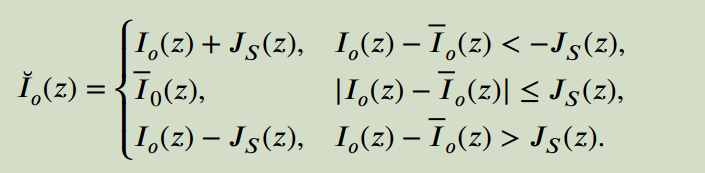
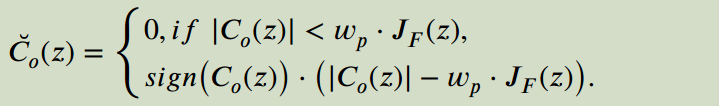
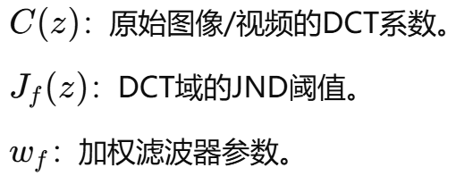
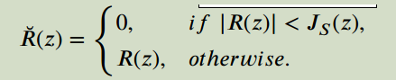
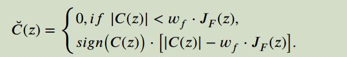
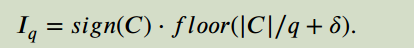
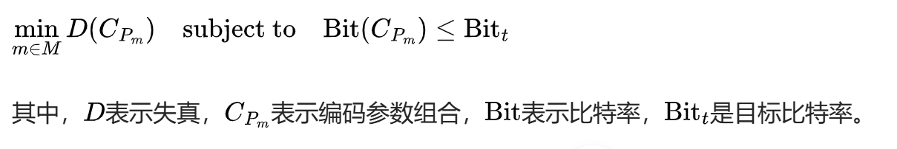
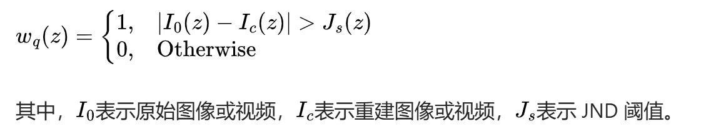
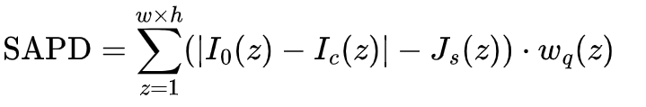

## A survey on just noticeable distortion estimation and its applications in video coding

本文的主要贡献可以简要概括如下：首先，系统地回顾了JND概念的一般描述和现有的JND计算模型。其次，介绍了基于jnd的感知图像和视频编码方案的大部分相关工作，包括基于jnd的编码预处理和基于jnd的编解码器嵌入。第三，对JND估计和基于JND的PVC进行了全面的总结，并对未来可能的发展方向和机遇进行了分析和讨论。

现有的基于jnd的感知图像/视频编码方案可分为基于jnd的编码预处理和基于jnd的编解码器嵌入两大类。在基于JND的编码预处理中，根据JND模型对感知冗余进行预估。在感知质量相近的前提下，对原始图像或视频进行基于jnd的滤波平滑处理，去除感知冗余。相反，基于JND的编解码器嵌入将JND估计过程直接引入到图像/视频编码过程中，并通过对不同编码模块的感知优化大大节省了比特率。

第2节和第3节回顾了JND估计和基于JND的感知视频编码。第4节讨论了未来的方向和机会。第五部分最后对本文进行了总结

### 3.1 基于JDN的编码预处理

**背景介绍**
JND (Just Noticeable Difference): 表示人眼刚刚能够感知到的变化阈值。基于JND的预处理可以去除人类视觉系统（HVS）无法感知的冗余信息，从而减少编码数据量。
**预处理目标:**
1. 在编码之前利用JND模型移除感知冗余。
2. 提高压缩效率而不影响主观视觉质量。

根据**应用域**的不同，预处理分为 空间域的JND编码预处理 (Spatial-JND Coding Preprocessing) 和 子带域的JND编码预处理 (Subband-JND Coding Preprocessing)。

**1. 空间域的JND编码预处理 (Spatial-JND Coding Preprocessing)**

其中，𝐼𝑜（z）和~𝐼𝑜（z）分别为原始空间残差和过滤后的空间残差。average 𝐼𝑜（z）是8 × 8块的平均值。𝐽𝑆（z）是估计的JND阈值。根据基于空间jnd的滤波器，图像块将被平滑并去除视觉细节。

在参考论文中提到采用逐步迭代的方式完成JND值估计和冗余去除。

**2.子带域的JND编码预处理 (Subband-JND Coding Preprocessing)**

主要思路:
在频域中通过DCT（离散余弦变换）等方法分离频率分量。
根据子带域的JND阈值（如频率敏感性）去除冗余信息。

如果某个系数的绝对值小于阈值 𝑤𝑓⋅𝐽𝑓(𝑧)，则直接置为0（去除冗余）。否则，仅保留超出阈值的部分，体现了对高感知成分的保留。

**总结**
1.空间域方法更适合快速处理和对复杂场景要求不高的场合。
2.子带域方法虽然计算复杂度较高，但对高质量的压缩和复杂视频内容具有显著优势。
3.基于JND的预处理在实际应用中需要在效率与精度之间平衡。

### 3.2 Perceptual Residual Filtering（感知残差滤波）
视频编码的残差（Residual）是预测块与原始块之间的差值，表示编码后的误差信号。感知残差滤波的目标是减少残差中人眼无法察觉的信息，从而降低比特率，同时不影响感知质量。

核心思路
感知残差滤波的实现依赖于“视觉感知阈值”（JND，Just Noticeable Difference）。如果残差的幅度低于JND阈值，则意味着这些残差对于人眼不可察觉，可以直接置零以减少冗余数据。

**两种方法：**
1.Spatial-JND Residual Filtering（空间域残差滤波）：

根据像素级JND模型，幅值小于JND阈值的残差直接滤除，被滤除的残差不会影响人眼感知质量。公式如下：

其中，𝑅(𝑧)为原始残差，𝐽𝑠(𝑧)为空间域JND阈值。

2.Subband-JND Residual Filtering（子带域残差滤波）：

(同上)

作用：结合频域信息更精确地移除不可察觉的残差。
优势：保留更多关键视觉信息，但计算复杂度较高。

### 3.3 Perceptually Adaptive Quantization（感知自适应量化）

背景：量化是视频编码中的关键步骤，用于减少数据量，但可能导致失真。感知自适应量化通过引入JND模型，调整量化参数（Qstep）以最小化失真对感知质量的影响。

实现：
**1.死区量化**
量化器引入“死区”机制来忽略幅值较小的信号，公式如下：

q：量化步长。
δ：死区偏移量。

作用：减少低幅值信号占用的比特，提高压缩率。

**2.基于JND的量化优化**

通过调整每个块的量化步长，尽量接近感知失真阈值。

**3.感知自适应策略**

根据JND模型调整每个宏块的量化步长，使其动态适应场景变化。
利用块级统计信息进一步精确调整量化参数。

### 3.4 Perceptual Rate-Distortion Optimization（感知率失真优化）

1. 视觉速率失真优化
在图像和视频编码中，码率和质量是一对矛盾体，通常由编码算法和编码参数决定。一个好的编码器需要在这对矛盾中找到一个折衷策略。由于存储容量和传输带宽的限制，视频编码通常存在平均码率限制。图像 / 视频编码优化的问题是找到在平均码率限制下的最小失真，这个问题可以用以下公式表示：

2. 感知失真测量
   通常，在 JND 阈值以下的失真无法被人眼感知。Yang 等人提出了一种感知失真因子，用来过滤掉那些无法被感知的失真。感知失真测量的公式如下：

   基于感知失真因子，总体感知失真（SAPD）的计算公式如下：
   
3. 拉格朗日多重优化

感知速率失真优化可以通过感知失真测量和拉格朗日多重优化来实现。此外，感知 RDO（率失真优化）已经广泛应用于图像 / 视频编码模块，如预测和环路滤波等。与其他基于 JND 的 PVC 方案相比，基于 JND 的感知 RDO 对降低比特率的贡献较小。
